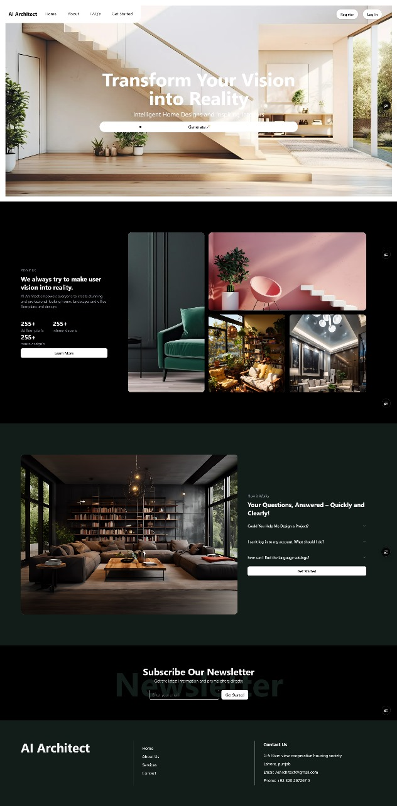
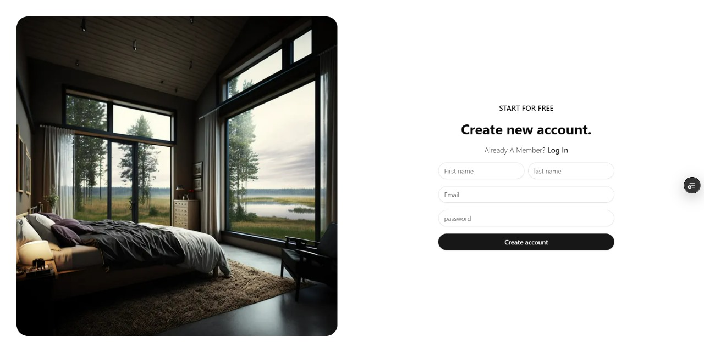
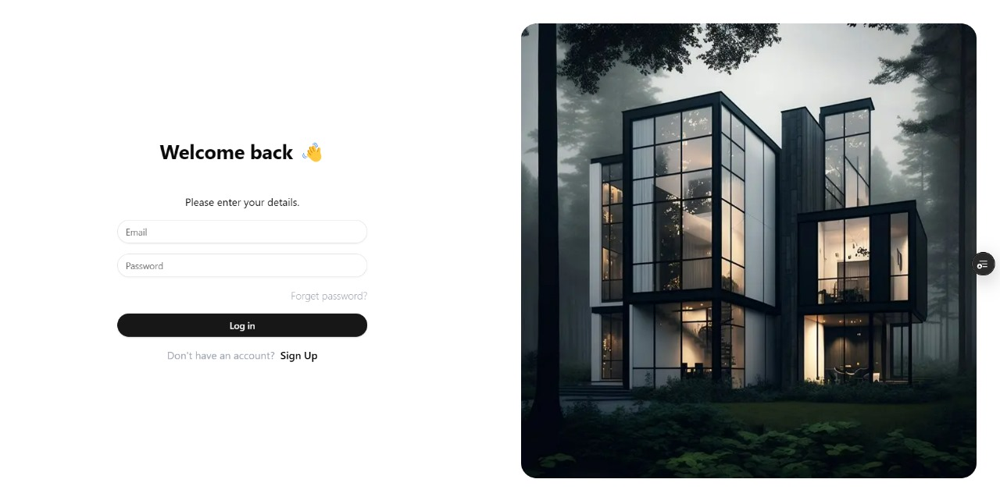
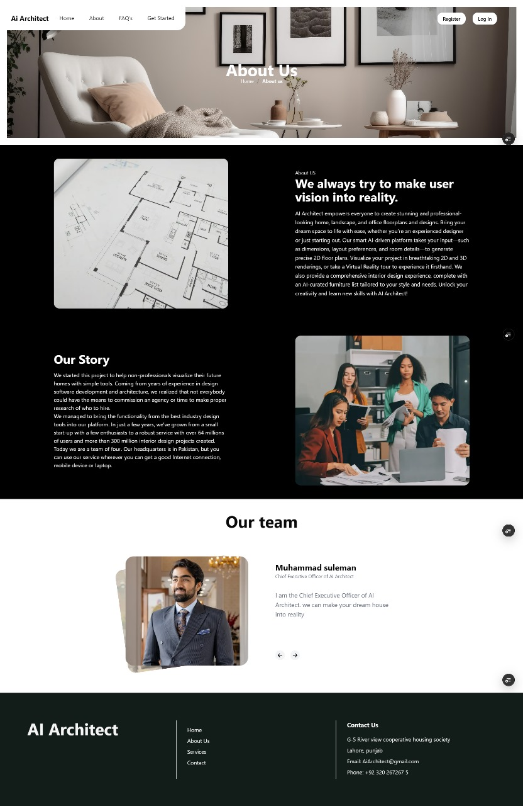
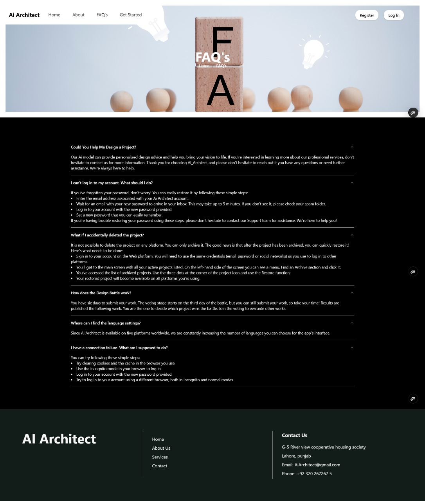
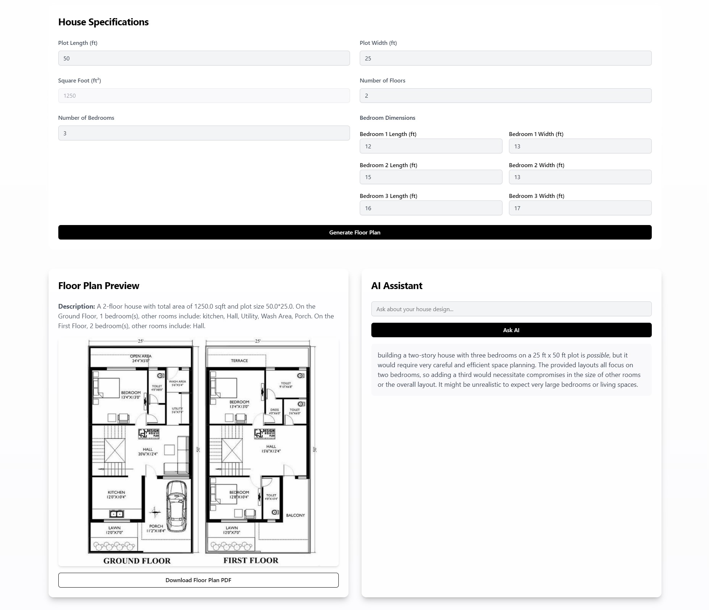
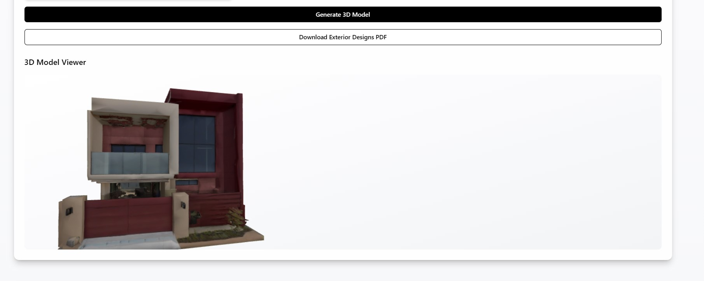
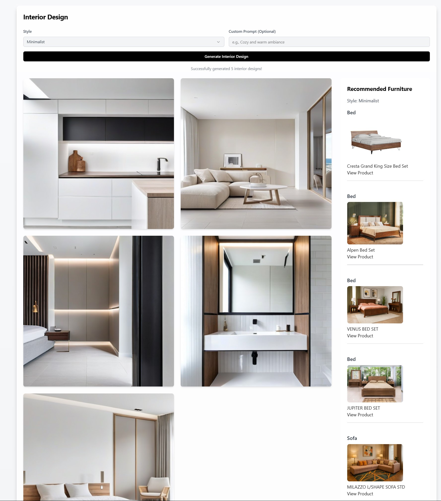

# AiArchitect

A cutting-edge AI-powered platform built with [Next.js](https://nextjs.org), designed to streamline architecture workflows and deliver a sleek, modern user experience.

---

## 🚀 Live Demo

Explore AiArchitect step by step:

| Step                      | Preview                                                |
|---------------------------|--------------------------------------------------------|
| Dashboard                 |                         | 
| Signup                    |                              |
| Login                     |                                |
| AboutUs                   |                             |
| FAQs                      |                              |
| Contact                   |                           |
| GetsStarted               |                         |
| Exterior Designs          |                    |
| 3D on Exterior            |                            |
| Interior Designs          |                   |

> **Note:** Screenshots are in the `demo/` folder. Replace these with your actual app screenshots for best presentation.

---

## 🛠️ Getting Started

To run this project locally:

1. **Install dependencies:**
    ```bash
    npm install
    # or
    yarn install
    # or
    pnpm install
    # or
    bun install
    ```

2. **Start the development server:**
    ```bash
    npm run dev
    # or
    yarn dev
    # or
    pnpm dev
    # or
    bun dev
    ```

3. **Open your browser:**  
   Visit [http://localhost:3000](http://localhost:3000) to view the app.

---

## 📁 Project Structure

- `app/page.tsx` – Main page component (edit this to update homepage)
- `public/demo/` – Demo screenshots for README and documentation
- `components/` – Reusable UI components
- `styles/` – CSS and global styles
- `utils/` – Utility functions

---

## 🎨 Fonts & Styling

This project uses [`next/font`](https://nextjs.org/docs/app/building-your-application/optimizing/fonts) for font optimization. The [Geist](https://vercel.com/font) font family provides a clean, modern look.

---

## 📚 Learn More

- [Next.js Documentation](https://nextjs.org/docs)
- [Learn Next.js](https://nextjs.org/learn) – Interactive tutorial
- [Next.js GitHub](https://github.com/vercel/next.js)

---

## 🚀 Deploy on Vercel

Deploy seamlessly using the [Vercel Platform](https://vercel.com/new?utm_medium=default-template&filter=next.js&utm_source=create-next-app&utm_campaign=create-next-app-readme).

See [Next.js Deployment Docs](https://nextjs.org/docs/app/building-your-application/deploying) for more information.

---

## 🤝 Contributing

Contributions are welcome!  
Please open issues and submit pull requests for improvements or bug fixes.

---

## 📝 License

This project is [MIT licensed](LICENSE).

---

> Made with ❤️ using [Next.js](https://nextjs.org/)
